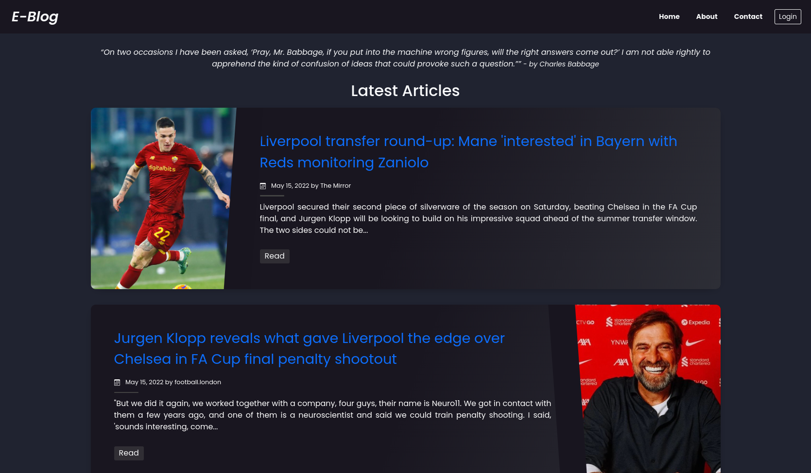

# Flask-Personal-Blog

A personal blog made with Flask, Bootstrap5 and PostgreSQL

### By: Edwin Karimi

## Table of Content

- [Description](#description)
- [Installation Requirements](#requirements)
- [Usage](#usage)
- [Technology Used](#technologies)
- [Licence](#licence)
- [Authors Info](#author-info)

## Description


<br>
<br>
This website is a personal blog made in Flask, Bootstrap for the UI and responsiveness and PostgreSQL for the database.
It is meant to have CRUD functionality i.e. C- create, R -read, U - update, D - delete. Unauthorized users can see post
and comment on posts.
Only authorized users can add, delete and update a post. They can also moderate comments by deleting offensive or
degrading comments.
The website also uses a random quote API to show random quotes at the top of the homepage.
It uses horizontal card formats to make it easy to read and use. The theme is also a bit dark to avoid eye-strain.

<b>
<em>Images and articles seen in the above and screenshots are not my own and are used for illustrative purposes. The authors of the articles and images are showed just below the article title.</em>
</b>


<br>
<br>

## Behaviour Driven Development

The user is able to;

- Login - for writers only
- See all posts with their author and date
- Add a post - for authorized personnel
- Update a post - for authorized personnel
- Delete a post - for authorized personnel
- Comment on a post
- Delete offensive or degrading comment - authorized users only
- See all comments for a post with the commenter and date of posting
- Upload a profile picture - for logged-in users
- Update the profile picture - for logged-in users

### Requirements

- A computer

- Access to the Internet

### Usage

- Make sure you have a stable internet to have the ability to clone the repository.
- Type the following command in your terminal to clone this repository

```
https://github.com/Edu58/Flask-Personal-Blog.git
```

If you are using SSH, use the following command

```
git clone git@github.com:Edu58/Flask-Personal-Blog.git
```

When you run the commands successfully, you should have a local version of this repository.

Before starting the application, run ```pip install -r requirements.txt``` to install the project dependencies.

To run the app, unzip the cloned folder if it is zipped. Otherwise, navigate inside the folder and
run ```python manage.py runserver``` or ```python manage.py server``` in your terminal. Any of these 2 should start the
server at
localhost:5000. Once the server is running, open your browser and enter localhost:5000 in your url bar of your
preferred browser, and you should be able to use the app now. This will only work on the computer running the server. It
is not available to anyone else.

### Online Repository

- Make sure you have a stable internet for forking this repository.
- According to the license, you can fork this project. You need to click on the forking icon, and it will be added as
  one
  of your repositories

Feel free to fork the project and have fun with it. Happy coding!

## Technologies

- Flask
- Bootstrap5
- PostgreSQL

## Licence

Copyright (c) Edwin Karimi 2022 - [MIT Licence](LICENSE)

## Author Info

- Twitter - [@GISDevEd](https://twitter.com/GISDevEd)
- Linkedin - [edwin-karimi](https://www.linkedin.com/in/edwin-karimi/)
